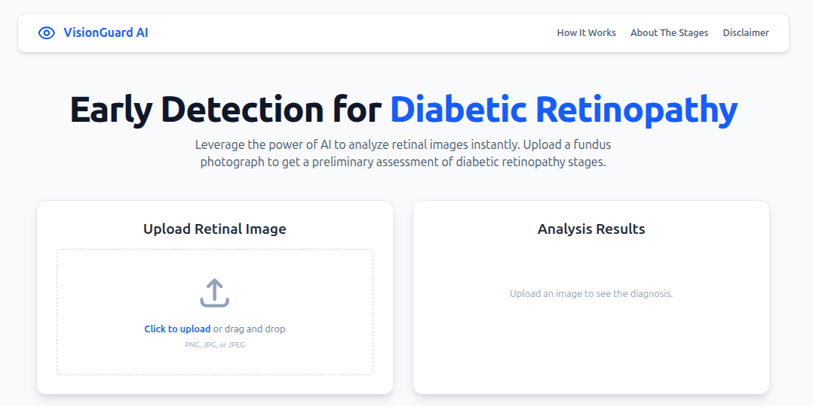

# VisionGuard AI



A web-based tool for the preliminary detection of Diabetic Retinopathy using a custom-trained deep learning model.

## 🤖 About The Project

As an AI Engineer, my goal is to build intelligent systems that solve real-world problems. **VisionGuard AI** is a portfolio project designed to demonstrate the end-to-end development of a deep learning solution for a critical healthcare challenge: the early detection of Diabetic Retinopathy.

The project encompasses the entire machine learning lifecycle:
*   **Model Development:** Training a Convolutional Neural Network (CNN) on the APTOS 2019 dataset to classify retinal fundus images into five stages of DR.
*   **Backend API:** Building a lightweight Flask server to host the trained model and expose a prediction endpoint.
*   **Frontend Interface:** Creating a responsive and user-friendly React application to provide an accessible interface for the model.

This project showcases skills in deep learning, model deployment, and full-stack application development.

## ✨ Key Features

*   **AI-Powered Diagnosis:** Leverages a TensorFlow/Keras model to classify retinal images.
*   **Interactive Web Interface:** A clean and modern UI built with React, Vite, and Tailwind CSS.
*   **Drag & Drop File Upload:** Intuitive user experience for selecting images.
*   **Detailed Results View:** Provides a clear diagnosis and description for the predicted stage.
*   **Analysis History Gallery:** Keeps a session-based history of previous analyses for comparison.
*   **Clickable Modal View:** Users can click on a history item to see a detailed pop-up view.
*   **Smooth Animations & Transitions:** Professional UI animations powered by Framer Motion.
*   **Responsive Design:** Fully usable on desktop, tablet, and mobile devices.

## 🛠️ Tech Stack

**Frontend:**
*   React.js
*   Vite
*   Tailwind CSS
*   Framer Motion (for animations)
*   React Scroll (for smooth scrolling)

**Backend:**
*   Python
*   Flask (for the web server)
*   TensorFlow / Keras (for the AI model)
*   Pillow (for image processing)

## 🚀 Running The Project Locally

To get a local copy up and running, follow these simple steps.

### Prerequisites

*   Node.js (v18 or later recommended)
*   Python (v3.9 or later recommended)
*   npm (comes with Node.js)

### Installation & Setup

1.  **Clone the repository:**
    ```sh
    git clone https://github.com/your-github-username/visionguard-app.git
    cd visionguard-app
    ```

2.  **Setup the Backend:**
    ```sh
    cd backend
    python3 -m venv venv
    source venv/bin/activate
    pip install -r requirements.txt 
    ```
    *(Note: You will need to create a `requirements.txt` file. See below.)*

3.  **Setup the Frontend:**
    ```sh
    cd .. 
    npm install
    ```

### Running the Application

1.  **Start the Backend Server:**
    *   Navigate to the `backend` directory and ensure your virtual environment is active.
    *   Run the Flask server:
        ```sh
        python3 app.py
        ```
    *   The backend will be running on `http://localhost:5000`.

2.  **Start the Frontend Application:**
    *   In a **new terminal window**, navigate to the project's root directory.
    *   Run the React development server:
        ```sh
        npm run dev
        ```
    *   Open [http://localhost:5173](http://localhost:5173) (or the address shown in your terminal) to view the application in your browser.