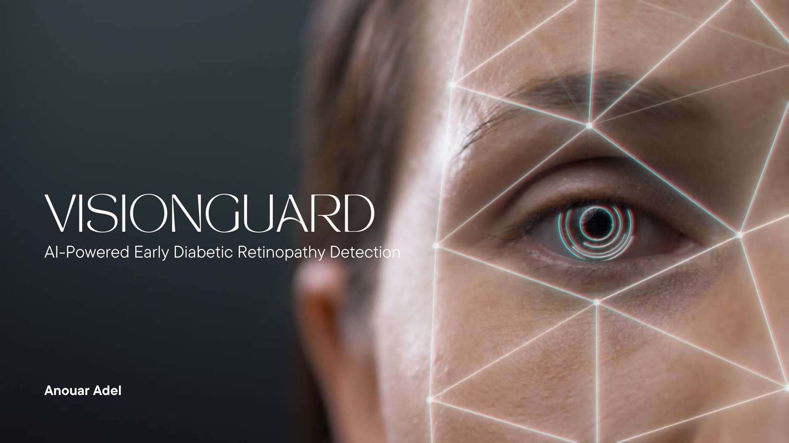
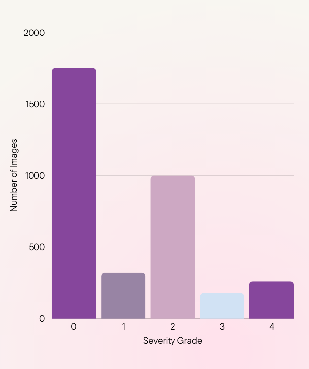

# VisionGuard AI



This repository contains the source code for **VisionGuard AI**, an AI-powered web application for the preliminary detection of Diabetic Retinopathy. The project features a deep learning model carefully trained to overcome the critical challenge of severe class imbalance common in medical datasets.

---

## About The Project

Diabetic Retinopathy (DR) is a leading cause of vision loss for people with diabetes. Early detection is critical to preventing severe outcomes. **VisionGuard AI** is a tool designed to provide a fast, accessible, and preliminary assessment of DR severity by leveraging a carefully trained deep learning model.

This project was built to demonstrate a full-stack approach to deploying a machine learning solution. It features:
*   A **Convolutional Neural Network (CNN)**, utilizing the EfficientNetB3 architecture, trained on the APTOS 2019 dataset with a sophisticated strategy to handle data imbalance.
*   A lightweight **Python/Flask backend** that serves the trained TensorFlow model through a REST API.
*   A responsive and interactive **React frontend** that allows users to upload an image and view the analysis in a user-friendly interface.

---

## The AI Model: From Challenge to Solution

The core of this project is a deep learning model trained to classify retinal images. The development process went beyond simple training to address a critical, real-world challenge common in medical imaging datasets.

### The Challenge: Severe Class Imbalance

The APTOS 2019 dataset, like many medical datasets, is highly imbalanced. The "No DR" (healthy) class contains far more images than all the diseased classes combined. A naive training approach results in a model that simply predicts the majority class, making it clinically useless.

*Initial Exploratory Data Analysis (EDA) confirmed this challenge:*


### The Training Strategy

To overcome this, a multi-stage, robust training strategy was implemented:

1.  **Transfer Learning:** Utilized the powerful **EfficientNetB3** architecture, pre-trained on ImageNet, as a feature extraction base.
2.  **Two-Phase Fine-Tuning:** The model was trained in two stages: first, training only the final classification layers, and then unfreezing the entire network for fine-tuning with a very low learning rate.
3.  **Class Weights:** To combat the data imbalance, **manually-tuned class weights** were introduced during training. This forced the model to pay significantly more attention to the minority classes (Mild, Moderate, Severe, and Proliferative DR).
4.  **Callbacks:** `EarlyStopping` and `ReduceLROnPlateau` were used to automate the training process, preventing overfitting and ensuring the model with the best validation performance was saved.

### The Result: A Balanced Classifier

This strategy resulted in a model with a **weighted F1-score of 0.65** that successfully learned to identify all five stages of the disease, overcoming the initial bias. The table below shows the final F1-score for each class, demonstrating a balanced diagnostic capability.

| Class               | F1-Score |
| :------------------ | :------: |
| 0 (No DR)           |   0.91   |
| 1 (Mild)            |   0.33   |
| 2 (Moderate)        |   0.53   |
| 3 (Severe)          |   0.19   |
| 4 (Proliferative)   |   0.21   |

### Further Experimentation: The Impact of CLAHE

As an additional research step, I hypothesized that enhancing local image contrast could improve feature detection. A second model was trained using **Contrast Limited Adaptive Histogram Equalization (CLAHE)** as a preprocessing step. While this technique significantly improved recall for the most severe stage (Proliferative DR), it decreased performance on the crucial "Moderate" stage. This experiment highlights the importance of empirical testing and analyzing performance trade-offs. The final saved model is the version trained **without** CLAHE, as it provides the best overall performance for a general diagnostic tool.

---

## Model Development

The complete, step-by-step process of data analysis, training, and evaluation for this model can be found in the accompanying Kaggle Notebook:

**[View the Kaggle Notebook](https://www.kaggle.com/code/anouaradel/visionguard-ai-for-diabetic-retinopathy-detection)**

---

## Tech Stack

**Frontend:**
*   React.js
*   Vite
*   Tailwind CSS
*   Framer Motion
*   React Scroll

**Backend & AI:**
*   Python
*   Flask
*   TensorFlow / Keras
*   EfficientNetB3 (Transfer Learning)
*   Scikit-learn (for evaluation and class weights)
*   Pillow

---

## Running The Project Locally

To get a local copy up and running, follow these simple steps.

### Prerequisites

*   Node.js (v18 or later)
*   Python (v3.9 or later)
*   npm & pip
*   Git LFS (for handling the large model file)

### Installation & Setup

1.  **Clone the repository:**
    ```sh
    git clone https://github.com/AnouarAdel/VisionGuard-AI.git
    cd VisionGuard-AI
    ```

2.  **Setup the Backend:**
    ```sh
    cd backend
    python3 -m venv venv
    source venv/bin/activate
    pip install -r requirements.txt 
    ```

3.  **Setup the Frontend:**
    ```sh
    cd .. 
    npm install
    ```

### Running the Application

1.  **Start the Backend Server:**
    *   Navigate to the `backend` directory and ensure your virtual environment is active.
    *   Run the Flask server:
        ```sh
        python3 app.py
        ```
    *   The backend will be running on `http://localhost:5000`.

2.  **Start the Frontend Application:**
    *   In a **new terminal window**, navigate to the project's root directory.
    *   Run the React development server:
        ```sh
        npm run dev
        ```
    *   Open [http://localhost:5173](http://localhost:5173) (or the address shown in your terminal) to view the application.

---

## License

This project is licensed under the MIT License. See the [LICENSE](LICENSE) file for details.